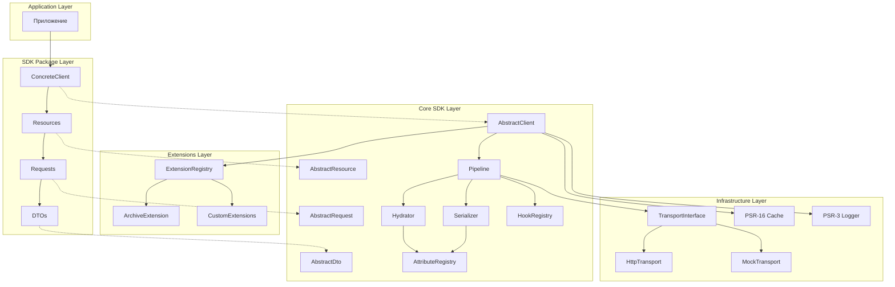

# Архитектура SDK — Обзор

**Package:** `brahmic/apisutra`  
**Namespace:** `Brahmic\ApiSutra`

## Слои системы



## Компоненты

### Core SDK (`brahmic/apisutra`)

| Компонент | Назначение |
|-----------|------------|
| `AbstractClient` | Базовый клиент, точка входа, конфигурация |
| `AbstractResource` | Навигация, группировка endpoints |
| `AbstractRequest` | Базовый запрос, атрибуты, сериализация |
| `AbstractDto` | Базовый DTO для response |
| `Pipeline` | Оркестрация выполнения запроса |
| `Hydrator` | Десериализация JSON → DTO |
| `Serializer` | Сериализация Request → HTTP |
| `HookRegistry` | Централизованные lifecycle hooks |
| `AttributeRegistry` | Обработчики кастомных атрибутов |
| `ExtensionRegistry` | Управление расширениями per-client |
| `RetryHandler` | Управление повторами запросов |
| `Validator` | Валидация запросов и DTO |
| `RateLimiter` | Лимиты запросов |
| `Paginator` | Пагинация |
| `CompositeExecutor` | Выполнение composite запросов |
| `DependsOnExecutor` | Выполнение зависимостей |
| `BatchExecutor` | Выполнение batch |
| `PoolExecutor` | Выполнение pool |

### Extensions (`Brahmic\ApiSutra\Extensions`)

| Компонент | Назначение |
|-----------|------------|
| `ExtensionInterface` | Контракт расширения |
| `ExtensionContext` | Регистрация компонентов расширения |
| `ExtensionRegistry` | Хранение и резолв extensions |
| `ArchiveExtension` | Built-in: работа с архивами (ZIP, TAR) |

### SDK Package (`vendor/concrete-sdk`)

| Компонент | Назначение |
|-----------|------------|
| `ConcreteClient` | Extends `AbstractClient`, конфигурация провайдера |
| `BaseRequest` | Extends `AbstractRequest`, `resolveClient()` |
| `Resources/*` | Навигация по API провайдера |
| `Requests/*` | Конкретные запросы к API |
| `DTOs/*` | Структуры ответов провайдера |

### Infrastructure

| Компонент | Назначение |
|-----------|------------|
| `TransportInterface` | Абстракция HTTP |
| `HttpTransport` | Production: Guzzle/PSR-18 |
| `MockTransport` | Testing: fake responses |
| `PSR-16 Cache` | Кеширование |
| `PSR-3 Logger` | Логирование |

---

## Пакеты и зависимости

```
brahmic/apisutra              # Ядро (0 зависимостей от конкретных SDK)
    ├── psr/http-client       # PSR-18
    ├── psr/simple-cache      # PSR-16
    ├── psr/log               # PSR-3
    └── guzzlehttp/promises   # Async

vendor/concrete-sdk           # Конкретный SDK
    └── brahmic/apisutra      # Зависимость от ядра
```

---

## Принципы архитектуры

| Принцип | Реализация |
|---------|------------|
| **Bounded Context** | Core SDK изолирован от конкретных провайдеров |
| **Dependency Inversion** | Зависимость от абстракций (interfaces) |
| **Composition > Inheritance** | Минимальная иерархия, инъекция сервисов |
| **Ports & Adapters** | Transport, Cache, Logger — внешние адаптеры |
| **Convention over Config** | Defaults + override через атрибуты |

---

## Точки расширения

| Точка | Механизм |
|-------|----------|
| Новый провайдер | Extends `AbstractClient`, `BaseRequest` |
| Кастомная auth | Implements `AuthenticatorInterface` |
| Кастомный каст | Implements `CastInterface` |
| Кастомный хук | Class + `HookRegistry::on()` |
| Кастомный атрибут | Attribute + Handler + `AttributeRegistry` |
| Кастомное расширение | Implements `ExtensionInterface` |
| Mock в тестах | `MockClient::global()` → DI подменяет Transport |

---

## Документы архитектуры

| Документ | Содержание |
|----------|------------|
| [01-contracts](./01-contracts.md) | Все интерфейсы SDK |
| [02-core-classes](./02-core-classes.md) | AbstractClient, AbstractRequest, AbstractResource |
| [03-pipeline](./03-pipeline.md) | Жизненный цикл запроса |
| [04-dto-system](./04-dto-system.md) | Hydrator, Casts, Nested |
| [05-transport](./05-transport.md) | TransportInterface, Http/Mock |
| [06-config](./06-config.md) | ClientConfig и вложенные VO |
| [07-attributes](./07-attributes.md) | Все атрибуты и их обработка |
| [08-extension-points](./08-extension-points.md) | Как расширять SDK |
| [09-implementation-order](./09-implementation-order.md) | Порядок реализации |
