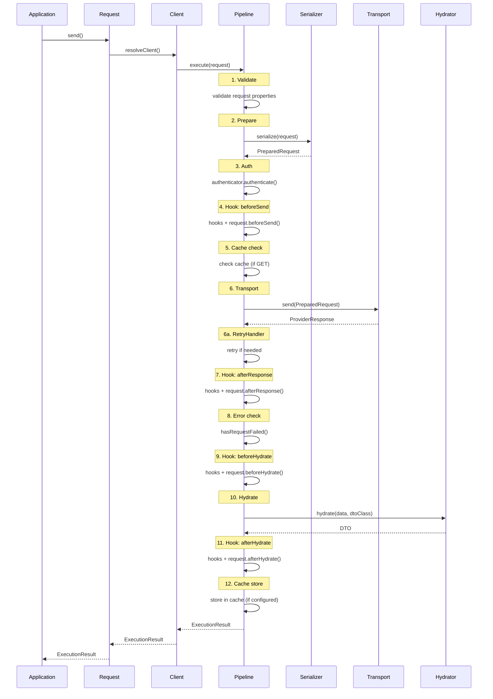

# Pipeline — Жизненный цикл запроса

Последовательность обработки запроса от вызова до результата.

---

## Общая схема



---

## Модульная структура Pipeline

Pipeline разделён на отдельные компоненты, каждый отвечает за свою область:

- `Preparation/RequestPreparer` — подготовка запроса, traceId, overrides.
- `Attributes/StageProcessor` — выполнение stage‑атрибутов.
- `Auth/AuthHandler` — аутентификация и refresh токена.
- `Hooks/HookRunner` — запуск хуков и hook‑атрибутов.
- `Cache/CacheManager` — чтение/запись/очистка кеша.
- `Transport/RetrySender` — отправка с retry/429/backoff.
- `Error/ErrorPolicy` — определение ошибок и исключений.
- `Hydration/ResponseHydrator` — гидрация результата/DTO/расширения.
- `Result/ResultFactory` — сборка `ExecutionResult`.
- `Execution/CompositeFlow` — composite/depends‑on ветка.
- `Diagnostics/AuditLogger` — audit‑лог и логирование этапов.

---

## Этапы Pipeline

### 1. Validation

```
Request properties → Validator → ValidationError[] | continue
```

- Собрать `#[Validate]` атрибуты
- Собрать `#[Label]` для сообщений
- Выполнить валидацию
- При ошибках: вернуть `ExecutionResult` с `ValidationError`, запрос НЕ отправляется
- При `throwOnErrors`: выбросить исключение (fail-fast)

### 2. Prepare (Serialization)

```
Request → Serializer → PreparedRequest
```

- Собрать атрибуты `#[Path]`, `#[Query]`, `#[Body]`, `#[Header]`
- Применить `NamingStrategy`
- Подставить path parameters
- Сформировать query string (`QueryArrayFormat`)
- Сериализовать body (JSON, multipart)
- Результат: `PreparedRequest` (готовый к отправке)

### 3. Authentication

```
PreparedRequest → Authenticator → PreparedRequest (с auth)
```

- Проверить `#[NoAuth]`
- Вызвать `authenticator.authenticate()`
- Добавить headers/query auth данные
- При 401: если `authRetryOn401` включён, выполнить refresh через
  `getRefreshRequest()` → `processTokenResponse()` и повторить запрос
  (до `authRetryAttempts`). Общий retry на 401 не применяется.

### 4. Hook: beforeSend

```
PipelineContext → HookRegistry(beforeSend) → Request.beforeSend()
```

- Централизованные хуки (по приоритету)
- Хук в классе запроса
- Можно модифицировать `PreparedRequest`

### 5. Cache Check

```
PreparedRequest → Cache → hit ? ProviderResponse : continue
```

- Для любого HTTP-метода, если кеш включен (ClientConfig/`#[Cache]`/`withCache()`)
- Проверить `withoutCache()` флаг (чтение и запись отключены)
- При hit: пропустить transport, вернуть cached response

### 6. Transport

```
PreparedRequest → Transport → ProviderResponse
```

- Rate limiting check
- Delay (если настроен)
- HTTP request (Guzzle/PSR-18)
- Результат: `ProviderResponse`

Retry выполняется на уровне pipeline (RetryHandler) и повторяет шаг 6 при необходимости.
RetryHandler запускается после `afterResponse` и error‑check и повторяет
только Transport → afterResponse → error‑check.

### Этапы `PipelineStage` (audit/logging)
- `Started`
- `BeforeSend`
- `HttpRequest`
- `HttpResponse`
- `BeforeHydrate`
- `AfterHydrate`
- `Completed`
- `Failed`

### RetryHandler

Компонент pipeline, который управляет повторами по `RetryConfig`,
`shouldRetry()` и `RetryableException`. Не затрагивает Hydration
и выполняет повтор только транспортного участка.

Интерфейс:

```php
interface RetryHandlerInterface
{
    public function handle(
        PreparedRequest $request,
        PipelineContext $context,
        RetryConfig $config,
        int $attempt,
    ): ProviderResponse;
}
```

### 7. Hook: afterResponse

```
PipelineContext (с response) → HookRegistry(afterResponse) → Request.afterResponse()
```

- Response получен (или ошибка)
- Можно логировать, модифицировать

### 8. Error Check

```
ProviderResponse → hasRequestFailed() → continue | ExecutionResult(failed)
```

- HTTP status code check
- Кастомная логика в клиенте
- При failed: формировать `RequestError`, `ExecutionResult`

### 9. Hook: beforeHydrate

```
array $data → HookRegistry(beforeHydrate) → Request.beforeHydrate(context, data) → array
```

- Модификация данных перед гидрацией
- Unwrap (достать из wrapper)
- Normalize
- `PipelineContext` содержит response и request; hook получает context и возвращает array
- `Request.beforeHydrate` получает context и текущий $data

### 10. Hydration

```
array $data + DTO class → Hydrator → DTO instance
```

- Вызвать `computed()` если `ResponseDtoInterface`
- Применить `#[From]` маппинг
- Применить `#[Cast]` (явные и автоматические)
- Рекурсивно обработать `#[Nested]`
- Создать DTO через конструктор

### 11. Hook: afterHydrate

```
PipelineContext (с DTO) → HookRegistry(afterHydrate) → Request.afterHydrate()
```

- DTO готов
- Post-processing

### 12. Cache Store

```
ProviderResponse → Cache (store)
```

- Сохранить в кеш (если настроен)
- TTL из конфига/атрибута/runtime

---

## PipelineContext

Контекст pipeline, доступный на всех этапах. Мутабельный для промежуточных данных.

```php
class PipelineContext
{
    public function __construct(
        public readonly RequestInterface $request,
        public readonly ClientConfig $config,
        public readonly string $traceId,
        public readonly RequestRole $role = RequestRole::Root,
        public readonly ?PipelineContext $parent = null,
        public readonly ?RequestOptions $options = null,
        public readonly ?PaginationOptions $paginationOptions = null,
        // Мутабельные — меняются в процессе pipeline
        public ?PreparedRequest $preparedRequest = null,
        public ?ProviderResponse $response = null,
        public ?object $dto = null,
    ) {}
    
    /**
     * Создать дочерний контекст (для nested/composite)
     */
    public function child(RequestInterface $request, RequestRole $role): self;
}
```

`RequestOptions` и `PaginationOptions` передаются в контекст отдельно, чтобы
runtime‑настройки и пагинация сохранялись без мутаций запроса.

### RequestRole

```php
enum RequestRole: string
{
    case Root = 'root';           // Основной запрос
    case Nested = 'nested';       // Часть Composite
    case Dependency = 'dependency'; // DependsOn зависимость
}
```

---

## Composite Pipeline

Для `CompositeRequestInterface`:

```
1. Validate composite
2. Get child requests: composite.requests()
3. For each child:
   - Create child context (role: Nested)
   - Execute pipeline
   - Collect result
4. Aggregate: composite.aggregate(results, ctx)
5. Return ExecutionResult with aggregated DTO
```

Параллельность определяется `#[Execution(mode: ExecutionMode::Parallel)]`.

---

## DependsOn Pipeline

Для `DependsOnRequestInterface`:

```
1. Get dependencies: request.dependencies()
2. For each dependency:
   - Create child context (role: Dependency)
   - Execute pipeline (sequential)
   - Collect result
3. Process: request.processDependencies(results, ctx)
4. Execute main request pipeline
5. Return ExecutionResult
```

Зависимости всегда выполняются последовательно.

---

## Batch Pipeline

Для `batch()`:

```
1. Collect requests
2. Determine execution mode (parallel/sequential)
3. For each request:
   - Execute pipeline
   - Collect in ResultCollection
4. Create BatchResult with BatchMeta
5. Return BatchResult
```

---

## Точки прерывания

| Этап | Условие | Результат |
|------|---------|-----------|
| Validation | Есть ошибки | `ExecutionResult(failed)` с `ValidationError` |
| Cache | Hit | `ExecutionResult(success)` из кеша |
| Transport | `ConnectionException` | `ExecutionResult(failed)` |
| Error Check | `hasRequestFailed()` = true | `ExecutionResult(failed)` |

---

## ControlFlowException

Исключения для управления flow:

| Exception | Эффект |
|-----------|--------|
| `RetryableException` | Retry запроса (до maxAttempts) |
| `EarlyReturnException` | Прервать pipeline, вернуть data |
| `RefreshTokenException` | Refresh token, повторить запрос |
