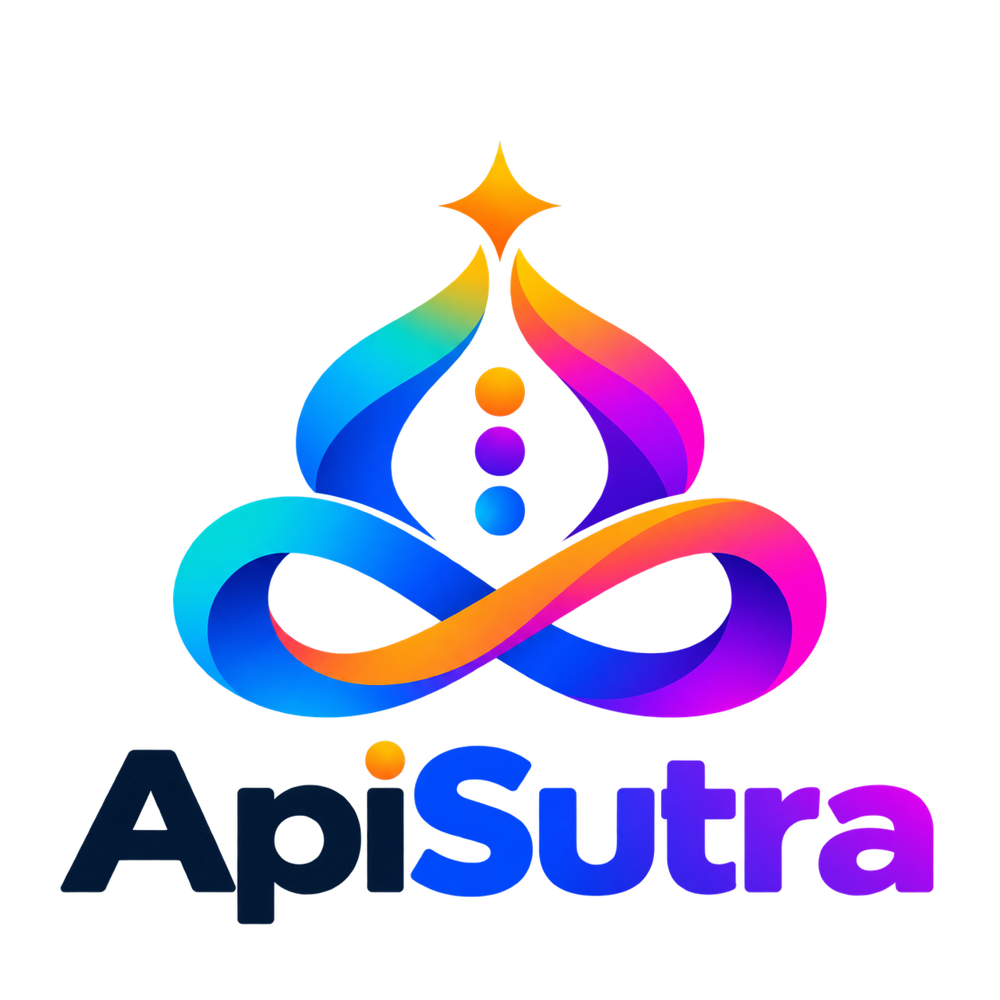

<p align="center">
  
</p>

# ApiSutra

Изменения совместимости: [миграция на следующий выпуск](docs/guides/migration.md).

[](https://github.com/brahmic/apisutra/actions/workflows/tests.yml)
[](https://github.com/brahmic/apisutra/actions/workflows/tests.yml)
[](./composer.json)
[](https://packagist.org/packages/brahmic/apisutra)

ApiSutra — фреймворк для построения SDK‑клиентов внешних API на PHP.
Он даёт декларативные запросы и DTO через атрибуты, единый pipeline выполнения
и расширяемость без копипаста.

## Ключевая идея
Вы описываете запросы, DTO и поведение декларативно, а инфраструктура
(auth, cache, retry, rate‑limit, pagination) работает единообразно для всех клиентов.

## Возможности
- атрибуты для HTTP, request/response и DTO‑маппинга
- единый pipeline с хуками, retries, rate‑limit, кешированием и timeouts
- пагинация, batch и pool
- мегаклиент для мультисервисных интеграций
- разделение сервисов по конфигам (baseUrl/auth) без смешивания логики 
- результаты и ошибки в едином формате
- расширения и касты
- тестовые инструменты (mock, fixtures, record/playback)
- интеграция с Laravel и auto‑detect контейнера

## Требования
- PHP 8.4+
- PSR‑18/PSR‑17 для `HttpTransport`
- PSR‑16 для внешнего кеша и общего счётчика rate-limit (строгая межпроцессная квота не гарантируется)

## Установка
```bash
composer require brahmic/apisutra
```

## Быстрый старт
```php
use Brahmic\ApiSutra\Attributes\Http\Get;
use Brahmic\ApiSutra\Attributes\Request\Query;
use Brahmic\ApiSutra\Attributes\Response\Returns;
use Brahmic\ApiSutra\Config\ClientConfig;
use Brahmic\ApiSutra\Contracts\Interfaces\Core\TransportInterface;
use Brahmic\ApiSutra\Core\AbstractClient;
use Brahmic\ApiSutra\Core\AbstractRequest;
use Brahmic\ApiSutra\DataTransfer\AbstractResponseDto;

final class DemoClient extends AbstractClient
{
    public function __construct(TransportInterface $transport)
    {
        parent::__construct(
            new ClientConfig(baseUrl: 'https://api.example'),
            $transport,
        );
    }
}

final readonly class UserDto extends AbstractResponseDto
{
    public function __construct(
        public int $id,
        public string $name,
    ) {}
}

#[Get('/users')]
#[Returns(UserDto::class, unwrap: 'data')]
final class GetUser extends AbstractRequest
{
    public function __construct(
        #[Query('id')]
        public int $id,
    ) {}
}

$client = new DemoClient($transport);
$request = new GetUser(1);
$request->setClient($client);

$user = $request->send()->dataOrFail();
```

Laravel: транспорт может быть подставлен автоматически через контейнер
при наличии PSR‑18 клиента.

## Тесты

Из корня репозитория пакета:

```bash
composer install
composer test
composer lint
composer analyse
composer check-docs
composer check-package
```

Для запуска одного файла:

```bash
vendor/bin/pest tests/Unit/Core/ValidatorTest.php
```

Тестовые зависимости включают Pest и компоненты Illuminate для проверки
Laravel-интеграции. Приложение ihpoh и база данных для запуска не нужны.

GitHub Actions запускает тесты на PHP 8.4 и 8.5 при каждом push и pull request.
Проверку также можно запустить вручную во вкладке Actions. Бейдж Tests показывает
результат проверки push в ветке `master`.

Бейдж Test count показывает число прошедших тестов из JUnit-отчёта одного прогона:
PHP 8.4 с зависимостями из `composer.lock`. Другие сочетания PHP и зависимостей
не суммируются; отдельная Laravel-проверка также не входит в это число.
При падениях или пропусках бейдж показывает их количество, при отсутствии отчёта —
`unavailable`. Данные обновляются после push или ручного запуска в `master` и
публикуются в служебной ветке `badges` через `GITHUB_TOKEN` с правом `contents: write`
только у задания публикации. Ветка создаётся автоматически при первом запуске;
до него бейдж с количеством недоступен. Shields.io может обновлять картинку с задержкой.

## Документация

- [Docs](./docs/README.md)
- [Guides](./docs/guides/README.md)
- [Примеры](./docs/example/)
- [Technical](./docs/technical/README.md)
- [Glossary](./docs/glossary/README.md)

## Для провайдеров
- [Анализ провайдера](./docs/guides/provider-analysis.md)
- [Методология провайдера](./docs/guides/provider-methodology.md)
- [Мегаклиент](./docs/guides/megaclient.md)
