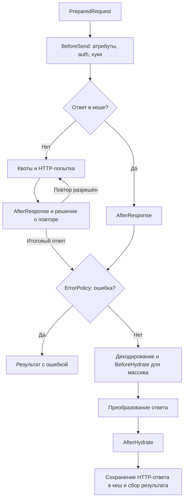

# Pipeline ядра

[Pipeline](../../src/Pipeline/Pipeline.php) организует отдельное выполнение запроса:
создаёт контекст, выбирает ветку обработки и возвращает `ExecutionResult`.
Выбор пагинации, batch/pool и ожидание continuation находятся уровнем выше;
их связи описаны в [потоках выполнения](execution.md).

## Контекст и начало исполнения

`Pipeline::execute()` извлекает исходный запрос и runtime-опции из `RequestExecution`.
[PipelineContextFactory](../../src/Pipeline/Flow/PipelineContextFactory.php) создаёт
контекст и прикрепляет его к `AbstractRequest`. Pipeline создаёт `ExecutionBudget`,
проверяет срок и совместимость режима ответа, затем запускает стадию `Started`.

[PipelineContext](../../src/VO/Pipeline/PipelineContext.php) связывает данные стадий:

| Данные | Назначение |
| --- | --- |
| `request`, `config`, `options`, `paginationOptions` | Исходная операция и её настройки |
| `role`, `parent`, `traceId` | Связь с родительским выполнением и трассировка |
| `budget` | Остаток времени для стадий, HTTP-попыток и дочерних вызовов |
| `preparedRequest`, `destination`, `fileTransfer` | HTTP-представление и условия его отправки |
| `response`, `lastResponse`, `dto` | Текущий ответ, последний доступный ответ и объект результата |
| `failureCode`, `failureException`, `transmissionState` | Причина сбоя и состояние передачи запроса |
| `cacheExecution`, `hydrationSourceTransformed` | Состояние кеша и граница преобразования исходных данных |

Контекст создаётся на выполнение. Сервисы клиента переиспользуются, поэтому
состояние текущего запроса нельзя переносить в их поля. В `finally` последний
доступный ответ дочернего выполнения передаётся родителю для диагностики.

## Валидация и выбор ветки

`runStages()` задаёт порядок до HTTP-отправки:

1. [PipelineValidator](../../src/Pipeline/Flow/PipelineValidator.php) проверяет запрос.
   Затем [RequestContractValidator](../../src/Pipeline/Flow/RequestContractValidator.php)
   проверяет декларативные ограничения полей. Ошибка завершает выполнение до подготовки.
2. [PipelineCompositeHandler](../../src/Pipeline/Flow/PipelineCompositeHandler.php)
   передаёт composite/depends-on в `CompositeFlow`. Возвращённый результат завершает
   текущую ветку; дочерние запросы и основная отправка depends-on имеют свои входы в Pipeline.
3. [RequestPreparationStep](../../src/Pipeline/Flow/RequestPreparationStep.php) через
   `PreparedRequestFactory` и `Serializer` собирает `PreparedRequest`.
4. [RequestFlowRunner](../../src/Pipeline/Flow/RequestFlowRunner.php) выполняет
   подготовленный запрос и обрабатывает ответ.

`skipValidation` и `skipComposite` используются при внутреннем повторном входе
после dependencies. Публичные правила подготовки принадлежат
[сериализации](../reference/serialization/README.md).

## От подготовленного запроса до результата

Схема показывает обычную ветку после подготовки. Ошибки отдельных стадий также
могут завершить её через границу исключений, описанную ниже.

Точный порядок задаётся `RequestFlowRunner` и его помощниками:

| Шаг | Ответственность |
| --- | --- |
| Проверка транспорта и подготовка кеша | Проверить поддержку назначения; подготовить состояние CacheManager |
| `PipelineStage::BeforeSend` | Дать обработчикам атрибутов изменить PreparedRequest |
| Авторизация | AuthHandler применяет стратегию с учётом назначения запроса |
| `Hook::BeforeSend` | Выполнить хуки над подготовленным запросом после авторизации |
| Проверки назначения и файлов | Проверить изменённый запрос до кеша и транспортной отправки |
| Получение ответа | Прочитать кеш либо вызвать RetrySender |
| ErrorPolicy | Классифицировать итоговый ответ; при ошибке собрать результат без обычной гидратации |
| Декодирование и гидратация | ResponseHydrator выбирает формат, HookRunner выполняет BeforeHydrate для массива, затем строится значение результата |
| После гидратации | Обработчики атрибутов для объекта, затем хуки AfterHydrate |
| Завершение | Извлечь метаданные, сохранить HTTP-ответ в кеш, доставить download при необходимости, собрать ExecutionResult |

### Кеш и повторные попытки

При cache hit `RequestFlowRunner` записывает ответ в `response` и `lastResponse`
и вызывает `AfterResponse`. Далее действуют общие ErrorPolicy и обработка ответа;
DTO заново создаётся гидратором клиента. В HTTP-кеше хранится ответ, а не DTO.

[RetrySender](../../src/Pipeline/Transport/RetrySender.php) управляет попытками:
проверяет бюджет, применяет rate-limit, отправляет запрос и вызывает `AfterResponse`
после полученного ответа. Затем решает вопрос восстановления авторизации и retry.
`BeforeSend` находится снаружи этого цикла; `AfterResponse` может выполниться
несколько раз. Правила повтора, восстановления тела, задержек и квот принадлежат
[retry](../reference/execution/retry.md),
[rate-limit](../reference/execution/rate-limit.md) и
[кешу](../reference/execution/cache.md).

### Преобразование ответа

[ResponseHydrator](../../src/Pipeline/Hydration/ResponseHydrator.php) выбирает raw,
download, response handler или стандартное декодирование. Для массива данных
`HookRunner` вызывает `BeforeHydrate`. Затем ResponseHydrator применяет выбранный
обработчик либо штатные unwrap, правила пагинации и гидрацию DTO.

Ненулевой результат response handler становится значением ответа и обходит штатные
unwrap и гидрацию. Возврат null передаёт обработку стандартному пути.
Raw и download имеют отдельные ветки; без DTO успешный ответ также может содержать
массив, scalar или null. Контракты — в
[расширениях](../reference/extensions/extensions.md#response-handlers-и-приоритет),
[режимах ответа](../reference/execution/transport.md) и
[успешном ответе без DTO](../reference/results/handles.md#успешный-ответ-без-dto).

## Подключение расширений

При штатной сборке клиента `ExtensionRegistry` регистрирует расширения в связанных реестрах
кастов, хуков и обработчиков атрибутов. Эти же реестры получают компоненты пайплайна.
Response handler выбирается через реестр при обработке ответа; его жизненный цикл
описан в [публичном контракте расширений](../reference/extensions/extensions.md#жизненный-цикл).

[HookRunner](../../src/Pipeline/Hooks/HookRunner.php) исполняет четыре вида хуков.
Порядок групп и приоритетов принадлежит [контракту хуков](../reference/extensions/hooks.md#порядок-исполнения).
`BeforeHydrate` получает отдельный путь вызова с массивом данных.
`AfterHydrate` вызывается и для результата без объекта DTO; обработка атрибутов
этой стадии требует объекта в `context.dto`.

[StageProcessor](../../src/Pipeline/Attributes/StageProcessor.php) передаёт управление
в `AttributeRegistry::processStage()`. В текущем пайплайне это три точки:
`Started` на запросе, `BeforeSend` на запросе и `AfterHydrate` на объекте результата.
Запись стадии в audit сама по себе не вызывает обработчики атрибутов.
Данные и порядок обхода описаны в [устройстве атрибутов](attributes.md).

Casts применяются внутри сериализатора и гидратора при преобразовании значений.
Для вложенных DTO внешние правила сохраняет `HydrationScope`; его публичный
контракт находится в [контексте гидратации](../reference/dto/scope.md).

## Ошибки и раннее завершение

Обычный неуспешный ответ классифицирует `ErrorPolicy`, а `ResultFactory` собирает
его ошибки. Исключения стадий обрабатывает
[ExecutionResultBuilder](../../src/Pipeline/Flow/ExecutionResultBuilder.php):
при `throwOnErrors = false` создаётся результат с ошибкой, при включённой настройке
исключение выходит через границу Pipeline.

`EarlyReturnException` из `RequestFlowRunner` имеет отдельный перехват в `runStages()`:
builder создаёт результат досрочного завершения, оставшиеся шаги не выполняются.
Эта граница находится после подготовки; произвольный ранний выход из любой части
пайплайна не следует считать эквивалентным этому механизму.

`ExecutionBudget` проверяется между стадиями и попытками. После возврата управления
из пользовательского обработчика превышение срока также может завершить запрос.
При внешних правилах DTO-путь и исходный путь сохраняются в результате,
а автоматический лог использует отдельный безопасный контекст. Подробнее — [ошибки](error-handling.md),
[диагностика DTO](../reference/dto/diagnostics.md) и
[deadline](../reference/execution/deadlines.md).

## Где проверять изменения

| Участок | Сценарии |
| --- | --- |
| Порядок валидации и ветвлений | [PipelineValidationOrderTest](../../tests/Unit/Pipeline/PipelineValidationOrderTest.php), [PipelineSkipFlagsTest](../../tests/Unit/Pipeline/PipelineSkipFlagsTest.php) |
| Хуки и ответ из кеша | [PipelineIntegrationTest](../../tests/Unit/Pipeline/PipelineIntegrationTest.php), [BeforeHydrateHookDataTest](../../tests/Unit/Pipeline/BeforeHydrateHookDataTest.php) |
| Ранний выход и исключения | [PipelineEarlyReturnStagesTest](../../tests/Unit/Pipeline/PipelineEarlyReturnStagesTest.php), [PipelineThrowOnErrorsTest](../../tests/Unit/Pipeline/PipelineThrowOnErrorsTest.php) |
| Формат ответа и расширения | [SuccessfulResponseContractTest](../../tests/Unit/Pipeline/SuccessfulResponseContractTest.php), [ExtensionResponseHandlerTest](../../tests/Unit/Extensions/ExtensionResponseHandlerTest.php) |
