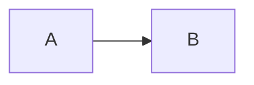

# Руководство по созданию документации проекта

## Триада документации

Документация строится на трёх компонентах с разным назначением:

```
docs/
├── glossary.md      — ЧТО (словарь терминов)
├── features/        — ЗАЧЕМ (возможности системы)
└── architecture/    — КАК устроено (для реализации)
```

---

## 1. Glossary — единый справочник терминов

### Назначение

Одно место, где определён каждый термин системы. Single Source of Truth.

### Правила

- Один термин = одно определение (1-3 предложения)
- Без примеров кода (только концепция)
- Группировка по категориям (разделители `---`)
- Если термин используется в других документах — он обязан быть здесь

### Формат записи

```markdown
### ТерминНазвание

Краткое определение. Что это такое и для чего нужно. Связь с другими терминами если есть.
```

### Когда обновлять

- Появился новый термин → добавить в glossary
- Изменился смысл термина → обновить определение
- Термин устарел → удалить

---

## 2. Features — что система делает

### Назначение

Описание возможностей с точки зрения пользователя. Отвечает на вопрос "как использовать".

### Содержит

- Use cases и сценарии использования
- Примеры кода (как вызывать)
- Конфигурация и настройки
- Ожидаемое поведение

### НЕ содержит

- Внутреннюю реализацию
- Детали классов и методов
- Алгоритмы обработки

### Структура папки

```
features/
├── README.md           — индекс всех возможностей
├── overview.md         — общий обзор системы
├── feature-a.md        — одна функциональная область
├── feature-b.md
└── ...
```

### Формат документа

```markdown
# Название возможности

## Обзор
2-3 предложения: что это и зачем нужно.

## Использование
Примеры кода, конфигурация.

## Варианты / Режимы
Разные способы применения.

## Резюме
| Элемент | Назначение |
|---------|------------|

## См. также
Ссылки на связанные документы.
```

---

## 3. Architecture — как устроено внутри

### Назначение

Техническая спецификация для реализации. Отвечает на вопрос "как построить".

### Содержит

- Интерфейсы и контракты
- Классы и их ответственности
- Диаграммы (потоки данных, слои, зависимости)
- Порядок реализации

### НЕ содержит

- Бизнес-примеры использования
- Инструкции "как вызывать"

### Структура папки

```
architecture/
├── README.md              — индекс с порядком чтения
├── 00-overview.md         — общая архитектура, слои
├── 01-contracts.md        — все интерфейсы
├── 02-core-classes.md     — основные классы
├── ...                    — детали по областям
└── NN-implementation-order.md — порядок реализации
```

### Нумерация файлов

Файлы нумеруются в рекомендуемом порядке чтения:
- `00-` — точка входа, общая картина
- `01-09` — основные концепции
- `10+` — детали и расширения

### Формат документа

```markdown
# Название компонента

## Назначение
Зачем этот компонент нужен в системе.

## Интерфейс / Контракт
```php
interface Example {
    public function method(): Result;
}
```

## Связи
С какими компонентами взаимодействует.

## Диаграмма (если применимо)

```

---

## Принципы

### 1. Single Source of Truth

Каждый термин/концепт определён в одном месте. Остальные документы ссылаются.

### 2. Разделение уровней абстракции

| Уровень | Документ | Вопрос |
|---------|----------|--------|
| Терминология | glossary | Что это? |
| Использование | features | Как применить? |
| Реализация | architecture | Как построить? |

### 3. Cross-linking

Явные ссылки между связанными документами:
```markdown
См. [Название](./path/to/doc.md)
```

### 4. Примеры обязательны

Каждая концепция в features сопровождается примером кода.

### 5. Таблицы для резюме

Итог раздела — таблица "Элемент | Назначение".

### 6. Визуализация потоков

Mermaid-диаграммы для:
- Последовательностей (sequence)
- Архитектуры слоёв (graph)
- Состояний (stateDiagram)

---

## Порядок создания документации

```
1. Glossary    — определить термины предметной области
       ↓
2. Features    — описать что система должна делать
       ↓
3. Architecture — спроектировать как это реализовать
```

### При итеративной разработке

```
Новая фича → Термины в glossary → Описание в features → Контракты в architecture
```

---

## Критерии полноты

Документация считается полной, когда:

| Критерий | Проверка |
|----------|----------|
| **Терминология** | Каждый термин из кода определён в glossary |
| **Покрытие** | Каждая публичная возможность описана в features |
| **Контракты** | Каждый интерфейс/класс специфицирован в architecture |
| **Связность** | Документы связаны перекрёстными ссылками |
| **Навигация** | Есть точка входа и порядок чтения |
| **DRY** | Определения не дублируются между документами |

---

## Масштабирование

### Glossary растёт

Разбить на файлы по категориям:
```
glossary/
├── README.md      — индекс
├── core.md        — базовые термины
├── domain-a.md    — термины области A
└── domain-b.md    — термины области B
```

### Features растут

Группировать по доменам:
```
features/
├── domain-a/
│   ├── feature-1.md
│   └── feature-2.md
└── domain-b/
    └── ...
```

### Architecture растёт

Выделять подсистемы:
```
architecture/
├── core/
├── subsystem-a/
└── subsystem-b/
```
